# Architecture

## Module Layout

```
src/
├── cli.ts           # Entry point, shebang, parse argv, call main()
├── app.ts           # main(), command routing (init, install, hook, render-copilot)
├── paths.ts         # RuntimePaths, runtimePaths(home?)
├── policy.ts        # loadEffectivePolicy, mergeValues, findProjectConfig, asList, getNested, orderedUnique
├── detector.ts      # detectSecretLeak, detectSensitiveRead, detectSensitiveCommand, policyMatchers
├── hooks.ts         # evaluateHook, cursorDecision, opencodeDecision
├── install-runtime.ts # installRuntime, hookCommandFor
├── io.ts            # writeText, readJsonDict, writeJsonDict, eprint, ensureParent
├── defaults.ts      # DEFAULT_POLICY, MANAGED_BLOCK_START, MANAGED_BLOCK_END
└── providers/
    ├── index.ts     # Re-exports
    ├── cursor.ts    # upsertCursorHooks
    ├── opencode.ts  # installPlugin (render + write)
    ├── codex.ts     # installConfig
    └── copilot.ts   # installArtifacts, renderExclusions
```

## Data Flow

```mermaid
flowchart TB
    subgraph init [init command]
        A[Read paths] --> B[Save DEFAULT_POLICY to global config]
    end

    subgraph install [install command]
        C[Load effective policy] --> D[Install runtime to ~/.config/secret-protector]
        D --> E[Per provider: upsert config/hooks]
    end

    subgraph hook [hook command]
        F[Read JSON stdin] --> G[Load effective policy]
        G --> H[evaluateHook provider event payload]
        H --> I[detector: detectSecretLeak / detectSensitiveRead / detectSensitiveCommand]
        I --> J[Return decision JSON stdout]
    end

    subgraph policy [Policy loading]
        K[DEFAULT_POLICY] --> L[merge with global YAML]
        L --> M[merge with project .secretrc]
    end
```



## Path Conventions

| Path | Purpose |
|------|---------|
| `~/.config/secret-protector/config.yaml` | Global policy |
| `~/.config/secret-protector/dist/` | Installed CLI (Node-compatible build) |
| `~/.config/secret-protector/bin/secret-protector-hook` | Wrapper that runs `node dist/cli.js hook "$@"` |
| `~/.cursor/hooks.json` | Cursor hooks |
| `~/.config/opencode/plugins/secret-protector.js` | OpenCode plugin |
| `~/.codex/config.toml` | Codex config |
| `~/.config/secret-protector/copilot-content-exclusions.txt` | Copilot global artifact |
| `./.secretrc` | Project override (walk up from cwd) |
| `./.github/copilot-content-exclusions.txt` | Copilot repo artifact |

## Dependency Graph

- `cli.ts` → `app.ts`
- `app.ts` → paths, policy, hooks, install-runtime, providers, io, defaults
- `hooks.ts` → detector, policy
- `detector.ts` → io, policy
- Providers → paths, io, policy, defaults (codex), install-runtime (cursor)
- `install-runtime.ts` → paths, io
